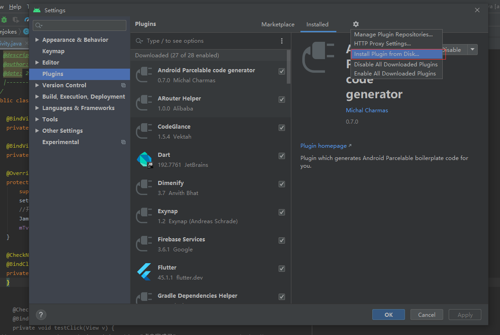
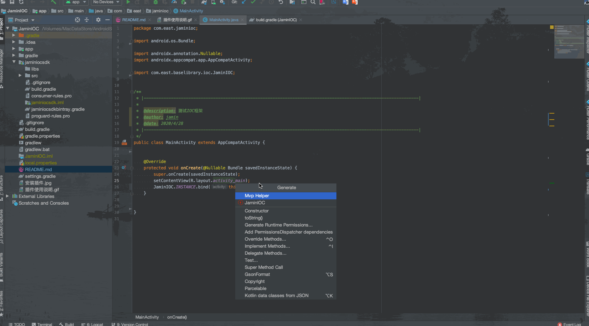

## <center>IOC注解框架</center>

### 说明

　　这是个人编写的一套IOC注解框架，主要能实现：  
-  自动bindView
-  自动生成click方法
-  检测网络连接
-  防止点击过快  

### 使用介绍

#### 先着重介绍四个注解
- @BindView(R.id.xx)//作用是绑定对应id的View
- @BindClick({R.id.xx,R.id.xxx}) //作用是标记对应id的View点击事件会调用到这个注解修饰的方法中
- @CheckNet(errorMsg = "好像没网诶") //没网时的提示,errorMsg可传可不传
- @ThrottleClick(5000L) //表示间隔5秒的点击才响应,可以不传值默认为1秒

#### 在AndroidStudio中编写时
```
    @BindView(R.id.test_tv)
    private TextView mTv;

    @BindView(R.id.test_iv)
    private ImageView mIv;
    
    @Override
    protected void onCreate(@Nullable Bundle savedInstanceState) {
        super.onCreate(savedInstanceState);
        setContentView(R.layout.activity_main);
        //开始进行解析
        JaminIOC.INSTANCE.bind(this);  //这行代码一定得加上,因为使用Kotlin编写,所以会有一个INSTANCE
        mTv.setText("这是Ioc获取到View后赋予的值");
    }
    
    @ThrottleClick(5000L)  
    @CheckNet/*(errorMsg = "好像没网诶")*/
    @BindClick({R.id.test_tv, R.id.test_iv})
    private void testClick(View v) {
//        Toast.makeText(MainActivity.this, "点击完成了", Toast.LENGTH_SHORT).show();
        int id = v.getId();
        if (id == R.id.test_tv) {
            Toast.makeText(MainActivity.this, "点击了文本框", Toast.LENGTH_SHORT).show();
        } else if (id == R.id.test_iv) {
            Toast.makeText(MainActivity.this, "点击了图片", Toast.LENGTH_SHORT).show();
        }
    }
```

#### 使用插件简单快捷生成对应的代码

　　首先 [下载插件](https://github.com/EastUp/JaminIOCPlugin/raw/master/JaminIOCPlugin.jar)

　　然后安装:



　　接着光标移到布局文件上,然后右键 -> Generate... -> JaminIOC



　　 最后记着 一定要布局文件后添加以下代码

```
JaminIOC.INSTANCE.bind(this);
```


      
     
 

